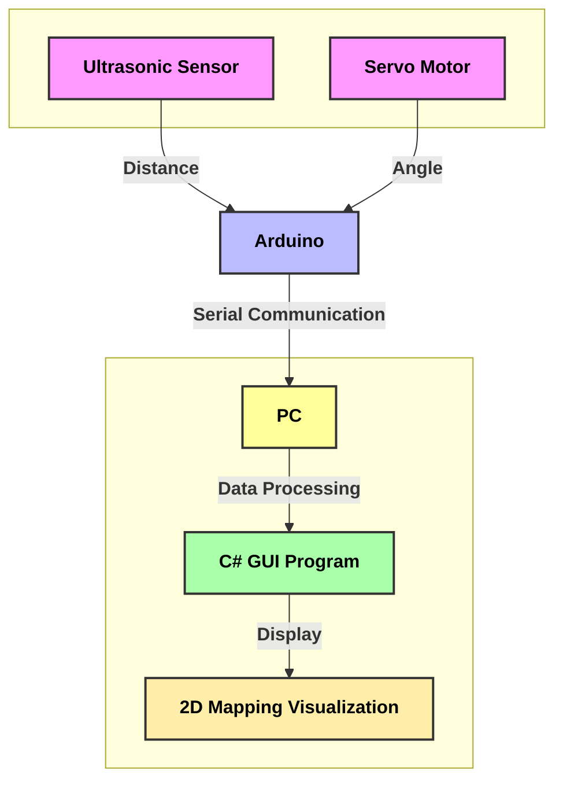

## 개요

**초음파 센서**와 **서보 모터**를 활용해 주변을 인식하고 시각적으로 맵핑하는 시스템을 만들어 보겠습니다.   

이 과정에서 **마이크로컨트롤러 (Arduino)**를 이용해 데이터 수집과 제어를 수행하고, **C# 기반 GUI**를 통해 실시간으로 데이터를 시각화합니다.


- 저렴한 **초음파 센서**로 라이다(LiDAR)와 유사한 SLAM 구현
- 서보 모터를 회전시켜 여러 각도에서 거리 데이터를 수집
- 실시간 데이터 시각화 및 맵핑
- 시리얼 통신을 통해 아두이노와 PC 간 데이터 전송

---

## 시스템 구성도


### HW 구성
1. **초음파 센서** (HC-SR04): 거리 데이터 수집
2. **서보 모터** (SG90): 회전 제어 및 각도 조절
3. **Arduino UNO**: 센서 데이터 처리 및 시리얼 통신 수행
4. **PC**: 데이터 시각화 (C# GUI 프로그램)

---

## 코드 구현

### **1. Sensor.c (초음파 센서)**
```cpp
#include "Sensor.h"
#include <Arduino.h>

void Sensor::setting(int trig) {
    pinMode(trig, OUTPUT);
    pinMode(echo, INPUT);
    Trigger();
}

void Sensor::Trigger() {
    wave_finished = false;
    digitalWrite(trig, LOW);
    delayMicroseconds(2);
    digitalWrite(trig, HIGH);
    delayMicroseconds(10);
    digitalWrite(trig, LOW);
}

double Sensor::send_dist() {
    if (wave_finished) {
        double dist = (pulsein - pulseout) / 58.2;
        Trigger();
        return dist;
    }
    return 0;
}
```
  
**설명:**
- 초음파 센서에서 거리 데이터를 수집하는 함수입니다.
- **Trigger()** 함수를 통해 동작합니다다.

---

### **2. Wiper.c (서보 모터)**
```cpp
#include "Wiper.h"
#include <Arduino.h>

void Wiper::attach(int pin) {
    servo.attach(pin);
    increment = 1;
    angle = 0;
}

void Wiper::wipe() {
    angle += increment;
    servo.write(angle);
    if (angle >= 180 || angle <= 0) {
        increment = -increment; // 방향 전환
    }
}

double Wiper::send_deg() {
    return double(angle); // 현재 각도 반환
}
```
**설명:**
- 서보 모터를 일정 각도(1도)만큼 회전시키며 데이터를 수집합니다.
- **wipe()** 함수는 서보의 각도를 변화시키고 방향을 자동으로 전환합니다.

---

### **3. 메인 코드.ino**
```cpp
#include "Wiper.h"
#include "Sensor.h"

Wiper wiper;
Sensor sensor;

void setup() {
    Serial.begin(9600);
    wiper.attach(11);  // 서보 모터 핀
    sensor.setting(3); // 초음파 센서 Trigger 핀
}

void loop() {
    wiper.wipe();
    double distance = sensor.send_dist();
    double angle = wiper.send_deg();

    Serial.print("Distance:");
    Serial.print(distance);
    Serial.print(" Angle:");
    Serial.println(angle);
    delay(100);
}
```
**설명:**
- 거리 데이터와 서보 모터의 각도 값을 시리얼 포트로 전송합니다.
- 이 데이터를 **PC**에서 수신하여 시각화합니다.

---

## C# GUI 프로그램 구현

C# 기반 GUI는 데이터를 수신하고 **TCanvas** 클래스를 이용해 실시간으로 맵핑 데이터를 시각화합니다.

> PC기반제어프로그래밍 강의에서 사용한 TCanvas 클래스


### **데이터 수신**
```csharp
private void serialPort1_DataReceived(object sender, SerialDataReceivedEventArgs e) {
    string data = serialPort1.ReadLine();
    string[] split = data.Split(':');
    double distance = Convert.ToDouble(split[0]);
    double angle = Convert.ToDouble(split[1]) * Math.PI / 180;

    double x = distance * Math.Cos(angle);
    double y = distance * Math.Sin(angle);
    canvas.DrawEllipse(Color.Black, -x, y, 3, 3);
}
```
**설명:**
- 시리얼 포트로 수신된 데이터를 파싱하여 거리와 각도 값을 구합니다.
- 구해진 데이터를 기반으로 2D 좌표를 계산하고 화면에 점을 그립니다.

### **맵핑 실행**
```csharp
private void btnMap_Click(object sender, EventArgs e) {
    canvas.ClearDrawing(Color.White);
    timer1.Start();
}

private void btnStop_Click(object sender, EventArgs e) {
    timer1.Stop();
    canvas.ClearDrawing(Color.White);
}
```

---

## 결과


어느정도 맵을 그리긴 했습니다.

하지만, 중간중간 Outlier가 많이 보이는 것을 알 수 있으며,

앞에 있는 물체가 모니터임에 불구하고 살짝 곡선의 형태로 맵핑되는 것을 확인할 수 있습니다.

**시연 영상:**
<iframe width="560" height="315" src="https://www.youtube.com/embed/UwfWkVGb4H8?si=KGuCzvKeu35lX-6y" title="YouTube video player" frameborder="0" allow="accelerometer; autoplay; clipboard-write; encrypted-media; gyroscope; picture-in-picture; web-share" referrerpolicy="strict-origin-when-cross-origin" allowfullscreen></iframe>

---

## 개선사항 및 확장 방향

1. **데이터 보정**:  
   한 각도에서 약 5개 정도의 거리 데이터를 획득한 후, 중앙값을 선택하는 방식으로?  

2. **센서 교체**:    
    더 정밀한 초음파 센서와 모터를 사용한다면?

3. **3D 구현**: 
    모터를 하나 더 추가해 시간은 오래걸리지만, 3D 매핑으로 확장 가능?

---

## Git Repo
[https://github.com/knowgyu/arduino-ultrasonic-mapping](https://github.com/knowgyu/arduino-ultrasonic-mapping)
