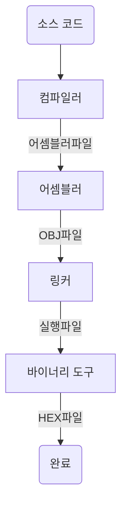

## 임베디드 시스템의 소프트웨어

임베디드 소프트웨어는 **운영체제(OS)** 유무에 따라 크게 두 경우로 나눌 수 있습니다.  
- **OS 없이 동작**: 아두이노 우노처럼 **단순한 기능**이 주 목적이고, 하드웨어가 비교적 **저사양**인 경우 직접 구현 가능  
- **OS 위에서 동작**: 라즈베리 파이처럼 **리눅스** 등 범용 OS를 탑재해 **복잡한 기능**을 처리할 수 있습니다.  
  - 이 경우 CPU 스케줄링, 메모리 관리 같은 기능을 OS가 담당하므로 편의성이 올라가지만, 그만큼 일정 수준 이상의 하드웨어 자원이 필요해집니다.  

OS가 있는 임베디드 소프트웨어에서는 **미들웨어(middleware)**가 추가로 제공될 수 있습니다.  
- 미들웨어는 **네트워크 스택**, **파일 시스템**처럼 애플리케이션에서 자주 쓰이는 기능을 모아 둔 **중간 계층**입니다.  
  -> 덕분에 **애플리케이션** 개발 시, 이미 준비된 **API**를 활용해 **개발 효율**을 높일 수 있습니다.

> 물론, OS 없이 개발하더라도 전부 바닥부터 짜는 건 아니고, **개발 환경**에서 기본 라이브러리를 제공하여 최소한의 기능을 지원하기도 합니다.
{: .prompt-tip }

---

## 임베디드 소프트웨어를 개발하는 흐름

보통 임베디드 소프트웨어는 **PC에서 고급 언어(C/C++ 등)로 작성**한 뒤,  
이를 **임베디드 환경**에서 동작할 수 있도록 변환(크로스 컴파일)해 **내장**합니다.

### 크로스 개발환경

PC에서 에디터로 코드 작성까지는 일반 PC용 프로그램 개발과 똑같습니다.  
하지만, **소스 코드**를 만든 이후에 **임베디드 시스템**이 이해할 수 있는 실행 형식으로 **변환**해야 합니다.  
- 예를 들어, PC(리눅스)라면 `gcc` 명령어로 빌드 후 바로 실행 가능하지만,  
- 임베디드용 CPU나 OS가 다르면, **명령어 셋**이나 **라이브러리 구조**가 달라 **그대로는 실행 불가**합니다.

이를 위해 **임베디드 시스템용 툴체인**(컴파일러, 링커, 라이브러리 등)을 설치하고,  
**크로스 컴파일**을 수행하는 개발 환경을 **크로스 개발환경**이라 부릅니다.

#### (참고) 어떤 점이 다른가?
이 개발환경이 다른 점에 대해 고민했던 부분이 있어 추가 설명합니다.  

- **CPU 차이**: x86(CISC) vs. ARM(RISC)  
  
  우선, CPU 아키텍처가 다를 경우 명령어 셋이 다르기에 당연히 실행될 수 없습니다.  
  또한, 32비트 OS와 64비트 OS는 메모리 주소 체계가 다르고 레지스터 사용 규칙 등의 차이가 있어 실행되지 않는 것이 당연하다고 느껴집니다.  

- **OS/LIBC 차이**: PC용 리눅스 vs. 임베디드 RTOS (또는 Bare Metal)  
  
  PC용 리눅스와 RTOS는 서로 시스템 콜이 다릅니다.  
  그렇기에, `malloc`같은 함수도 인터페이스가 동일하지 않을 수 있기에 실행되지 않습니다.  

- **라이브러리 버전**: 임베디드 glibc 버전이 다르면 호환성 문제 발생
  
  이 부분이 헷갈렸는데, 만약 PC도 32비트 리눅스, 임베디드 시스템도 32비트 리눅스면 가능하지 않을까? 라고 생각했습니다.  
  하지만, 임베디드 리눅스의 경우 조금 더 경량화된 `glibc` 라이브러리를 사용하는 등 라이브러리가 다르기에 호환되지 않는 상황이 발생할 수 있다고 합니다.

즉, 대부분의 환경에서는 크로스 컴파일이 필수적이라고 생각할 수 있겠습니다.

> **정말로 CPU·OS·라이브러리까지 전부 동일**하다면, 크로스 컴파일 없이 **네이티브 빌드**도 가능합니다.  
> 라즈베리파이에서 `gcc`를 설치하고 PC역시 ARMv7에 동일한 운영체제를 사용하는  
> 정말 완전 동일한 환경이라면 크로스 컴파일이 필요 없습니다.  
{: .prompt-tip }


### 빌드 작업

빌드는 소스 코드를 **임베디드 시스템의 CPU가 이해할 수 있는 형태**로 만드는 일련의 과정입니다.  
- **컴파일** → **어셈블** → **링크** → **HEX(ROM) 파일 생성**
- 일반적으로 “컴파일”은 고급 언어를 기계어로 바꾸는 단계만 가리키고,  
  “빌드”는 **최종 실행 파일**(또는 펌웨어 이미지)까지 생성하는 전체 과정을 의미합니다.

#### 빌드 과정

아래는 각 단계별 입출력을 간단히 나타낸 흐름도 예시입니다.



> - **컴파일**: C/C++ → 어셈블리 코드  
> - **어셈블**: 어셈블리 코드 → OBJ 오브젝트 파일  
> - **링크**: OBJ와 라이브러리를 합쳐 최종 실행 파일(ELF 등) 생성  
> - **바이너리 변환**: ELF 등을 **HEX**나 **BIN** 형식으로 변환 (실제 ROM에 기록)

---

### 실제 빌드의 흐름 확인하기

예를 들어, 아두이노용 임베디드 소프트웨어를 만들 때는 `avr-gcc` 툴체인을 사용합니다.  
아래는 “Hello World!”를 예로 들어 간단히 살펴보겠습니다.

```c
#include <stdio.h>

int main(){
    printf("Hello World!\n");
    return 0;
}
```

#### (참고) 실습 전 환경 확인
실습하는 환경은 Ubuntu 22.04 x86-64입니다.
- `avr-gcc`를 설치
  ```bash
  sudo apt install gcc-avr
  ```

> 이후 빌드하더라도 `stdio.h` 표준 라이브러리를 제공하지 않기에 빌드되지 않습니다.  
> 따라서, `avr/io.h` 를 사용해 `printf`가 아닌 다른 방식으로 작성해야합니다.
> 하지만, 여기서는 툴체인을 추가 설치해 사용할 것입니다.  
{: .prompt-warning }


- 표준 C 라이브러리(`stdio.h` 등)를 아두이노 MCU에서 쓰려면, `avr-libc`도 추가 설치가 필요합니다.
  ```bash
  sudo apt install avr-libc
  ```


#### 컴파일 & 링크 & ELF 생성

- 아래 명령어는 전처리·컴파일·어셈블·링크 과정을 거쳐 **ELF 형식**의 실행 파일(`test.elf`)을 만듭니다.
  ```bash
  avr-gcc -Os -Wall -mmcu=atmega328p main.c -o test.elf
  ```
- PC용이었다면 여기서 `./test.elf`로 실행할 수 있지만, 아두이노에서는 **HEX 파일** 형태로 ROM에 기록해야 합니다.

> 각 과정에 대해선 후술하겠습니다.  


#### HEX 파일 변환

- **avr-objcopy** 유틸을 사용해 ELF를 **HEX** 형식으로 바꿉니다.
  ```bash
  avr-objcopy -I elf32-avr -O ihex test.elf test.hex
  ```
- 이렇게 생성된 **test.hex**가 **아두이노(ATmega328p MCU)**에서 실제로 실행할 수 있는 펌웨어 이미지입니다.
- 이후, 아두이노 개발 툴(또는 avrdude 등)을 통해 이 HEX 파일을 **ROM**에 기록하면 프로그램이 동작하게 됩니다.

---

### 프리프로세스, 어셈블, 링크의 예시

#### 프리프로세스(전처리)
C언어의 매크로를 전개해 `#include`, `#ifdef`등 디렉티브(directive)를 처리합니다.  

실제로 프리프로세스만을 수행하고 결과를 확인하겠습니다.  
```
avr-gcc -Os -Wall -mmcu=atmega328p -E main.c > preprocess.c
```

**preprocess.c**
```c
# 1 "main.c"
# 1 "<built-in>"
# 1 "<command-line>"
# 1 "main.c"
# 1 "/usr/lib/avr/include/stdio.h" 1 3 
# 44 "/usr/lib/avr/include/stdio.h" 3
# 1 "/usr/lib/avr/include/inttypes.h" 1 3 
# 37 "/usr/lib/avr/include/inttypes.h" 3
# 1 "/usr/lib/gcc/avr/5.4.0/include/stdint.h" 1 3 4 
# 9 "/usr/lib/gcc/avr/5.4.0/include/stdint.h" 3 4 
# 1 "/usr/lib/avr/include/stdint.h" 1 3 4 
# 125 "/usr/lib/avr/include/stdint.h" 3 4 

# 125 "/usr/lib/avr/include/stdint.h" 3 4 
typedef signed int int8_t __attribute__((__mode__(__QI__)));
typedef unsigned int uint8_t __attribute__((__mode__(__QI__)));
typedef signed int int16_t __attribute__ ((__mode__ (__HI__)));

...
...(중략)
...

extern int setvbuf(FILE *stream, char *buf, int mode, size_t size);
extern FILE *tmpfile(void);
extern char *tmpnam (char *s);
# 2 "main.c" 2


# 3 "main.c"
int main(){
 printf("Hello World!\n");
 return 0;
}

```

#### 컴파일
프리프로세스에 의해 전개된 소스 코드를 어셈블리어로 변환하는 작업입니다.  

```
avr-gcc -Os -Wall -mmcu=atmega328p -S preprocess.c
```

**preprocess.s**
```
	.file	"preprocess.c"
__SP_H__ = 0x3e
__SP_L__ = 0x3d
__SREG__ = 0x3f
__tmp_reg__ = 0
__zero_reg__ = 1
	.section	.rodata.str1.1,"aMS",@progbits,1
.LC0:
	.string	"Hello World!"
	.section	.text.startup,"ax",@progbits
.global	main
	.type	main, @function
main:
/* prologue: function */
/* frame size = 0 */
/* stack size = 0 */
.L__stack_usage = 0
	ldi r24,lo8(.LC0)
	ldi r25,hi8(.LC0)
	call puts
	ldi r24,0
	ldi r25,0
	ret
	.size	main, .-main
	.ident	"GCC: (GNU) 5.4.0"
.global __do_copy_data

```

#### 어셈블
어셈블리어로 변환한 결과를 목적 파일(OBJ 형식)으로 변환합니다.
만약, 라이브러리를 사용하고 있다면 이 단계에서 목적 파일을 만들더라도 실행되지 않습니다.  
```
avr-as -mmcu=atmega328p -o main.o preprocess.s
```

`main.o`의 내용은 바이너리파일이라 텍스트 에디터로는 확인할 수 없습니다.  
```
gyu@gyu:~/workspace/ebtb$ cat main.o
ELFS<�4(
       Hello World!���������GCC: (GNU) 5.4.0��>��=�� ?��)��5��BGLpreprocess.c__SP_H____SP_L____SREG____tmp_reg____zero_reg__mainputs__do_copy_data

@A;@�$b.strtab.shstrtab.text.data.bss.rodata.str1.1.rela.text.startup.comment!44,24
        N0O�Wd
```

#### 링크
링크 처리를 통해 의존하고 있는 라이브러리를 합체해 실제로 실행할 수 있는 파일로 변환합니다.  

```
avr-ld -o test.elf main.o ~/work/arduino-1.8.xx/...
```
뒤에 들어가는 인자는 이번 프록그램에 필요한 네가지 파일의 장소를 지정합니다.  
(crtatmega328p.o, libc.a, libatmega328p.a, libgcc.a) 이는 환경마다 달라서 필요에 따라 변경해야합니다.  


근데, 일단 명령어가 복잡하니 간단하게 `avr-gcc`명령어를 사용하겠습니다.  
```
avr-gcc -Os -mmcu=atmega328p -o test.elf main.c
```


#### HEX 파일 변환
실제 ROM에 기록하기 위해 **HEX 파일**로 변환을 합니다.  
인텔과 모토롤라 두 가지 형식이 있으며, 임베디드 시스템의 CPU에 맞춰 선택해야합니다.  

```
avr-objcopy -I elf32-avr -O ihex test.elf test.hex
```


이런 과정을 모두 포함해 **빌드**라고 부르며, 각각의 단계는 명령어나 옵션을 달리하여 확인할 수 있습니다.

---

> 위 내용은 **제이펍**의 "**임베디드 엔지니어 교과서**"를 읽고 공부한 것을 정리한 글입니다.  
> 저자명 : 와타나베 노보루, 마키노 신지 / 역자명 : 정인식
{: .prompt-tip }
